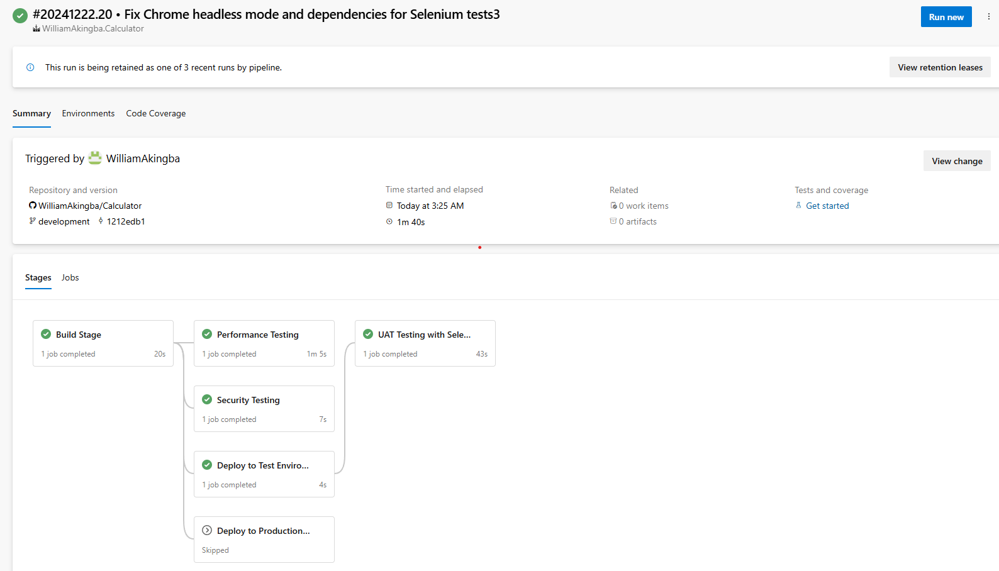
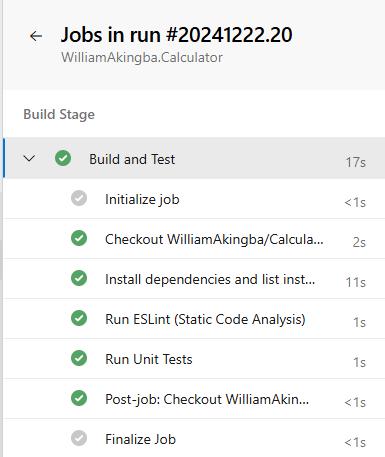
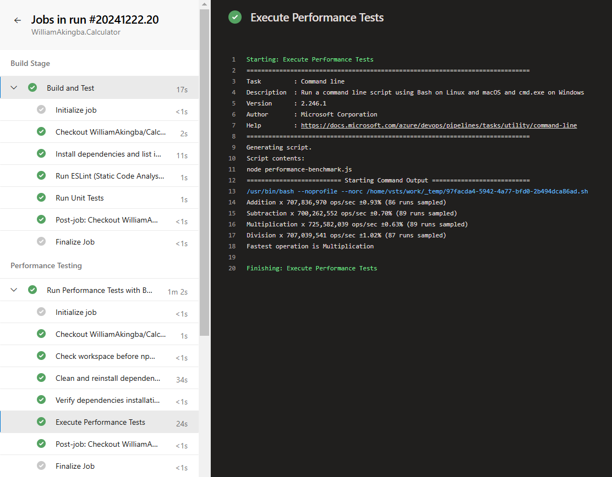
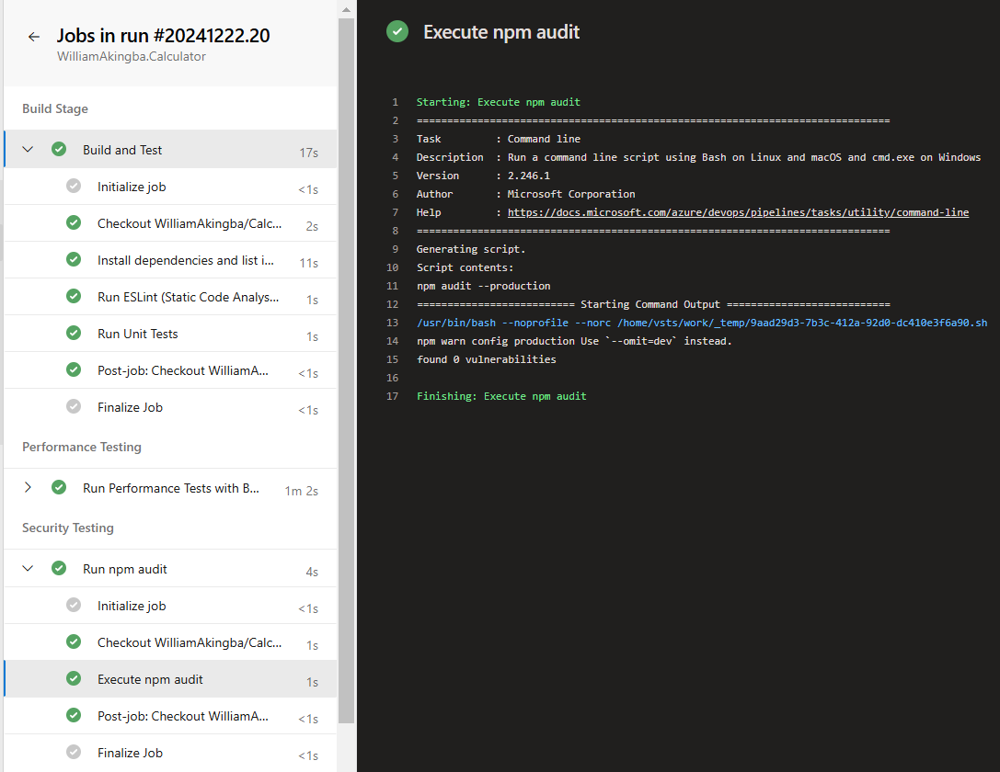
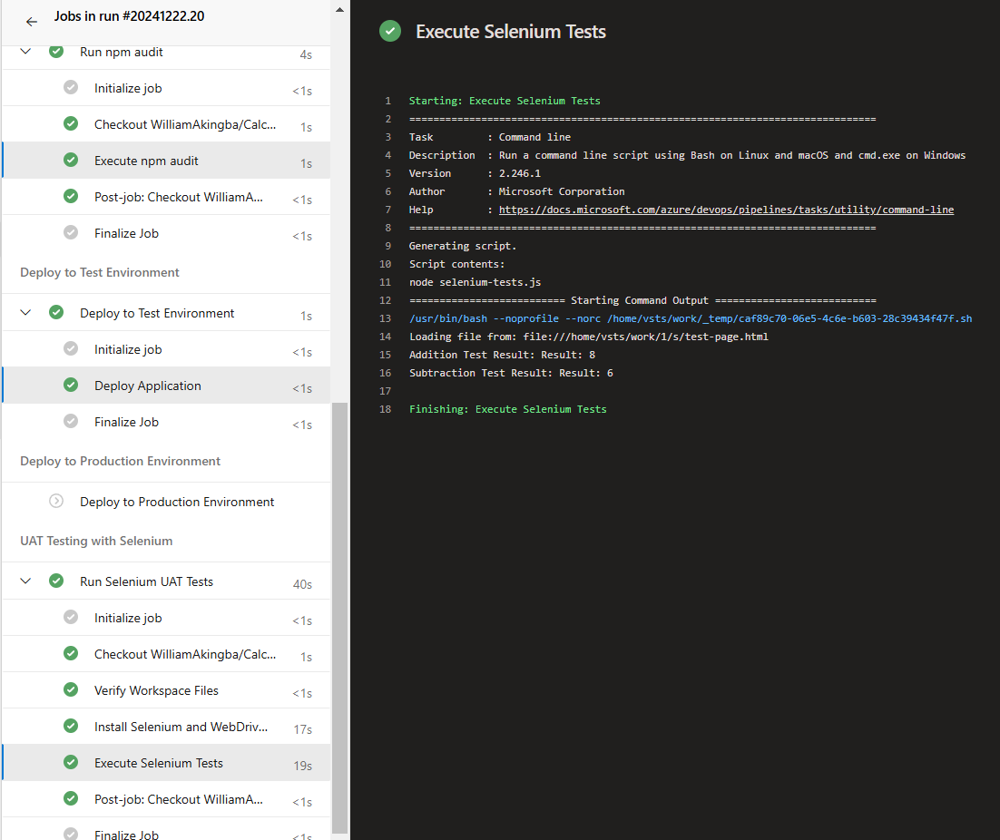
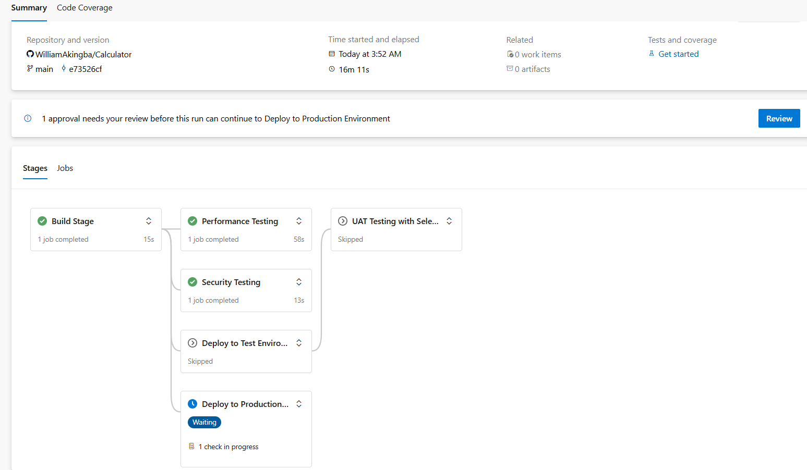
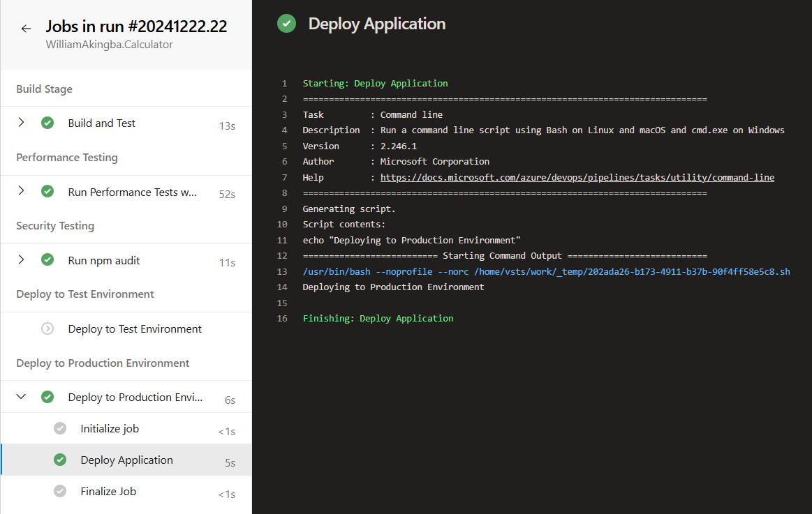

Calculator Application with CI/CD Pipeline
Overview
The Calculator Application is a Node.js-based project designed to perform basic arithmetic operations, including addition, subtraction, multiplication, and division. It features robust error handling and integrates an Azure DevOps CI/CD pipeline to automate testing, code quality checks, and deployments. Additional stages for security testing, performance testing, and user acceptance testing (UAT) are included to ensure the application’s reliability and security.

________________________________________
Technologies Used
•	Node.js: Application runtime environment.
•	Jest: Unit testing framework.
•	ESLint: Static code analysis tool.
•	eslint-plugin-security: Security-focused linting plugin for JavaScript code.
•	Azure DevOps: CI/CD pipeline management platform.
•	Selenium: User Acceptance Testing framework.
•	Benchmark.js: Performance testing library.
________________________________________
Application Features
•	Arithmetic Operations: Supports addition, subtraction, multiplication, and division.
•	Error Handling: Ensures all inputs are numbers and throws errors for invalid inputs or division by zero.
•	Unit Testing: Validates functionality and error handling using Jest.
•	Static Code Analysis: Enforces coding standards and identifies potential issues using ESLint.
•	Security Analysis: Detects potential vulnerabilities using eslint-plugin-security.
•	Performance Testing: Benchmarks core arithmetic operations using Benchmark.js.
•	User Acceptance Testing (UAT): Validates application behavior using Selenium.
•	CI/CD Pipeline: Automates builds, testing, and deployments with manual approval gates.
________________________________________
Local Development Setup
1.	Clone the repository: 
2.	git clone https://github.com/WilliamAkingba/Calculator.git
3.	cd Calculator
4.	Install dependencies: 
5.	npm install
6.	Run unit tests: 
7.	npm test
8.	Perform static code analysis: 
9.	npx eslint .
10.	Run UAT tests locally (ensure ChromeDriver is installed): 
11.	npm install selenium-webdriver chromedriver --save-dev
12.	node selenium-tests.js
________________________________________
CI Pipeline Implementation
The CI/CD pipeline, implemented using Azure DevOps, includes the following stages:
1.	Build Stage: 

o	Installs dependencies (npm install).

o	Runs ESLint for static code analysis.

o	Executes Jest unit tests.

2.	Deploy to Test: 

o	Automatically deploys changes pushed to the development branch to the Test environment.

3.	Deploy to Production: 

o	Deploys changes pushed to the main branch to the Production environment after manual approval.

4.	Performance Testing: 

o	Benchmarks core arithmetic operations using Benchmark.js.

5.	Security Testing: 

o	Executes npm audit to identify vulnerabilities.

6.	UAT Testing: 

o	Runs automated Selenium scripts to validate application behavior.

________________________________________
Branch Policies and Protection

1.	development Branch: 

o	Used for active development and testing.

o	Automatically triggers deployment to the Test environment via the pipeline.

2.	main Branch: 

o	Used for production-ready code.

o	Requires manual approval before deployment to the Production environment.

3.	Branch Protection Rules: 

o	Enable pull request policies in Azure DevOps to enforce code reviews and restrict direct pushes.

________________________________________
Testing Strategy

1.	Unit Testing: 

o	Validates functionality of arithmetic operations and error handling using Jest.

2.	Static Code Analysis: 

o	Enforces coding standards and identifies potential issues using ESLint and eslint-plugin-security.

3.	Performance Testing: 

o	Benchmarks arithmetic operations using Benchmark.js.

4.	Security Testing: 

o	Detects vulnerabilities in dependencies using npm audit.

5.	UAT Testing: 

o	Automated Selenium scripts validate addition and subtraction functionality.
________________________________________
Troubleshooting
1.	Pipeline Fails in Build Stage: 
o	Ensure package.json and dependencies are correctly configured.
o	Fix any ESLint errors or warnings.
2.	Deployment to Test or Production Fails: 
o	Check the environment configuration in Azure DevOps.
o	Verify permissions for the pipeline to access environments.
3.	Manual Approval Issue: 
o	Ensure approvers are correctly assigned to the Production environment.
4.	Selenium Errors: 
o	Ensure ChromeDriver is installed and updated.
o	Confirm the test HTML file exists at the specified path.
5.	Benchmark.js Errors: 
o	Verify Benchmark.js is correctly installed as a dependency.
o	Ensure arithmetic functions in calculator.js work as expected.
________________________________________
Environment Setup and Configuration
1.	Test Environment: 
o	Deploys changes from the development branch.
2.	Production Environment: 
o	Deploys changes from the main branch.
3.	Assign appropriate pipeline permissions for accessing these environments in Azure DevOps.
________________________________________
Deployment Process
1.	Push changes to development: 

o	Triggers the pipeline and runs build, security, performance, and UAT tests before deploying to the Test environment.

2.	Merge development into main: 

o	Push changes to the main branch to deploy to Production after successful pipeline execution and manual approval.
________________________________________
Security and Performance Testing
1.	Security Testing: 
o	Uses eslint-plugin-security to detect potential vulnerabilities in JavaScript code.
o	Runs npm audit to check for issues in project dependencies.
2.	Performance Testing: 
o	Benchmarks key arithmetic operations using Benchmark.js.
________________________________________
UAT Testing with Selenium
•	Selenium scripts validate addition and subtraction functionality on a test HTML page.
•	Integrated into the Azure DevOps pipeline as an automated stage after Test environment deployment.
________________________________________
Pipeline Approval Gates
•	Approval gates are configured for the Production environment to ensure deployments require manual review before proceeding.
•	Approvers can verify logs, test results, and code changes prior to approval.
________________________________________

